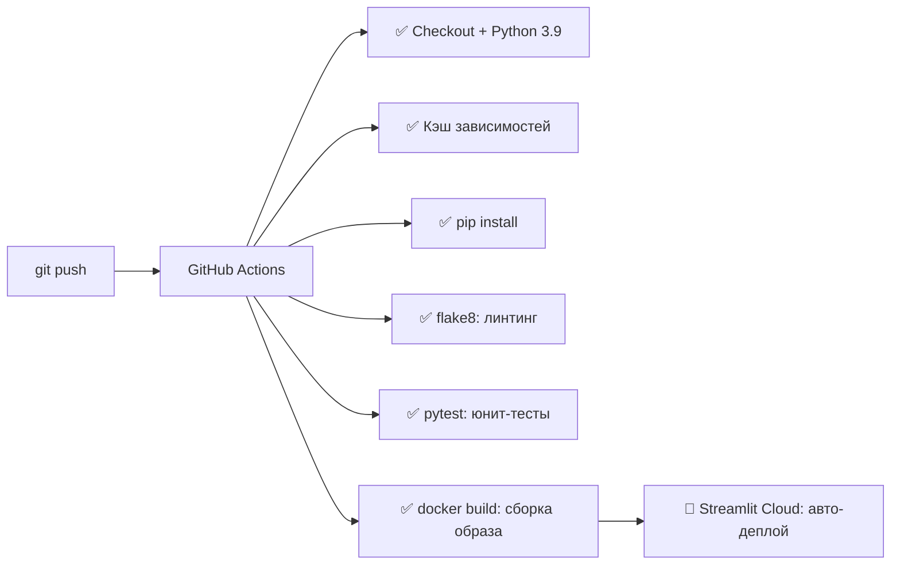

# 🚗 Car Price Predictor v2

Машинное обучение для предсказания стоимости автомобиля. Проект проходит полный цикл: от очистки данных и обучения до деплоя веб-приложения с автоматизированным CI/CD.

🔗 **[Попробовать демо](https://car-price-predictor-v2-2026.streamlit.app/)**  
📂 **[Датасет (Kaggle)](https://www.kaggle.com/datasets/hellbuoy/car-price-prediction)**

---

## ✨ Возможности приложения

- 🎯 **Прогноз цены** — мгновенный расчёт на основе CatBoost (R² = 92.85%)
- 🎲 **Случайный автомобиль** — кнопка заполняет форму случайными данными из датасета
- 🔍 **Сравнение с реальностью** — показывает фактическую цену из датасета (если найдено точное совпадение)
- 📊 **Визуализация** — гистограмма сравнения твоего прогноза с медианой и средней ценой по рынку
- 🔧 **Интерактивные фильтры** — слайдер мощности и выбор типа кузова для анализа данных

---

## 📊 О проекте

Цель проекта — создать точную модель для оценки стоимости авто на основе характеристик. 

**Ключевая особенность:** реализовано **сравнение двух алгоритмов**:
1. **PyTorch (MLP)** — нейронная сеть
2. **CatBoost** — градиентный бустинг

В продакшен (`app.py`) интегрирована победившая модель **CatBoost** (точность выше при меньшем коде).

### 🏆 Результаты сравнения

| Алгоритм | R² Score (Test) | 
|:---|:---:|
| **PyTorch MLP** | 90.07% |
| **CatBoost** | **92.85%** ✅ |

---

## 🛠 Технологии

| Категория | Инструменты |
|-----------|-------------|
| **Язык** | Python 3.9+ |
| **ML / DS** | CatBoost, PyTorch, Pandas, Scikit-learn, Matplotlib |
| **Frontend** | Streamlit |
| **Тестирование** | Pytest (Unit-тесты) |
| **Качество кода** | Flake8 (Linting) |
| **DevOps** | Git, GitHub Actions (CI/CD), Docker |
| **Данные** | Kaggle Dataset |

---

## 🛡️ CI/CD и Качество кода

Проект настроен на **автоматическую проверку** при каждом `git push` с помощью GitHub Actions:



### Что проверяется автоматически:
| Шаг | Инструмент | Зачем |
|-----|-----------|-------|
| 🔍 Линтинг | `flake8` | Ловит синтаксические ошибки, неиспользуемые импорты, нарушения PEP 8 |
| 🧪 Тесты | `pytest` | Проверяет бизнес-логику (например, валидацию мощности) |
| 🐳 Контейнеризация | `docker build` | Гарантирует, что приложение соберётся в чистой среде |
| ⚡ Кеширование | `actions/cache` | Ускоряет сборку с 3-4 минут до ~30 секунд |

---

## 🚀 Как запустить

### Вариант 1: Локально (Python)
```bash
# 0. Скачай данные
# Помести car_data.csv в корень проекта

# 1. Клонирование
git clone https://github.com/RomanRu96/car-price-predictor-v2.git
cd car-price-predictor-v2

# 2. Установка зависимостей
pip install -r requirements.txt

# 3. Обучение модели (создаст артефакты)
python train.py

# 4. Запуск приложения
streamlit run app.py
```

### Вариант 2: Docker (рекомендуется для продакшена)
Приложение полностью контейнеризировано и готово к запуску в изолированной среде.

```bash
# Сборка образа
docker build -t car-price-app .

# Запуск контейнера
docker run -p 8501:8501 car-price-app
```
Приложение будет доступно по адресу: `http://localhost:8501`

> 💡 **Преимущество Docker:** одинаковое поведение на любой ОС (Windows, macOS, Linux) без настройки окружения.

---

## 🧪 Тестирование

Проект включает юнит-тесты для проверки ключевой логики.

```bash
# Запуск всех тестов
python -m pytest

# Запуск с подробным выводом
python -m pytest -v
```

### Пример теста (`tests/test_utils.py`):
```python
from utils import validate_horsepower

def test_valid_hp():
    assert validate_horsepower(150) == True  # Валидная мощность

def test_low_hp():
    assert validate_horsepower(30) == False  # Слишком мало

def test_high_hp():
    assert validate_horsepower(350) == False  # Слишком много
```

---

## 📁 Структура проекта

```text
car-price-predictor-v2/
├── .github/workflows/hello.yml  # CI/CD пайплайн (линтинг, тесты, Docker)
├── .gitignore                   # Исключения для Git (кэш, venv, .env)
├── app.py                       # Веб-интерфейс Streamlit
├── train.py                     # Скрипт обучения (MLP + CatBoost)
├── model.py                     # Архитектура PyTorch MLP
├── utils.py                     # Вспомогательные функции (валидация)
├── tests/
│   └── test_utils.py           # Юнит-тесты
├── Dockerfile                   # Инструкция для сборки контейнера
├── requirements.txt             # Зависимости проекта
├── model_config.json           # Метаданные модели (R², категории)
├── cleaned_car_data.csv        # Очищенный датасет для демо
└── README.md                   # Этот файл
```

---

## 🔧 Обработка данных

✅ Извлечение марки из полного названия  
✅ Исправление опечаток (vokswagen → volkswagen, maxda → mazda)  
✅ Обработка пропусков в horsepower  
✅ One-Hot Encoding категорий  
✅ Сохранение очищенного датасета (`cleaned_car_data.csv`)

---

## 🤝 Контакты

**Автор:** Роман  
**GitHub:** [github.com/RomanRu96](https://github.com/RomanRu96)  

💡 *Проект создан в рамках обучения. Все права на датасет принадлежат [Kaggle](https://www.kaggle.com/datasets/hellbuoy/car-price-prediction).*
